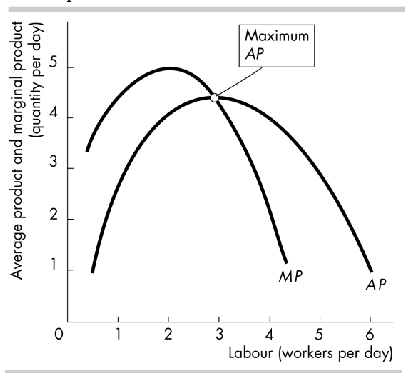
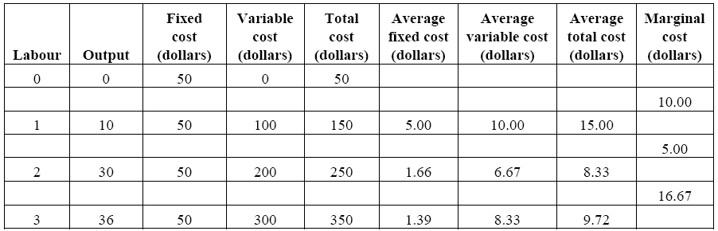
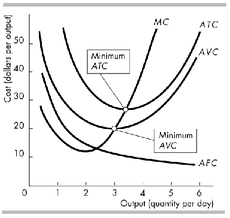
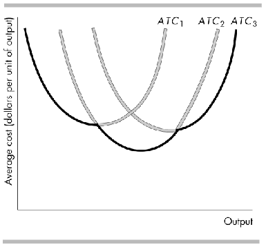

# Chapter 11 - Ouput and Costs

- short run, firms need to increase the quantity of labour employed in order to increase its production
- long run, firm can increase quantity of any or all of factors of production it empoys to increase production
- firms must pay forthe factors they use, so when a firm changes its production, its cost changes

## 1. Decision Time Frame
- firm owner's decisions can be categorized as short run decision and long run decisions
	- __short run__ is a time frame in which the quantitties of some factors of production are fixed. The fixed factors include the firm's management organization structure, level of techonology, buildings and large equipment. These factors are called the firm's __plant__
	- __long run__ is a time frame in which the quantities of all factors of production can be varied. Long-run decisionsare not easily reversed so usualyl a firm must live with the plant size that it has created for some time. The past costs of buying a plant that has no resale value is caloed a __sunk cost__

## 2. Short-Run technology Constraint
To increase its output in the short run, firms must increase the quantity of labour employed. There are three relationships between the quantity of labour and the firm's output.

### Product Schedules
- __Total product__ is the max output that a given quantity of labour can product. The __marginal product__ of labour is the icnrease in total product that results from a one-unit increase in the quantity of labour employed with all other inputs remaining the same. The __average product__ of labour is equal to the total product of labour divided by the quantity of labour. The table has examples

| Labour | Total Product | Marginal product | Average Product |
|--------|---------------|------------------|-----------------|
| 0  	 | 0             |  		        |				  |
|        |       		 | 10  	    	    |  			      |
| 1      | 10     		 |    	  			| 10 			  |
|        |       		 | 20  	  			|  				  |
| 2      | 30      		 |    	  			| 15  			  |
|        |		         | 6   	  			|  				  |
| 3      | 36   		 |    	  			| 12 			  |

### Product Curves

- The __total product curve__ illustrates the total product schedule. The __slope__ of the total product curve equals the marginal product of labour at the quantity of labour
- The __marginal product curve__ shows the additional output generated by each additional unit of labour. The marginal product of labour curve (MP) has an upside-down U shape. Increasing marginal returns occurs when the marginal product of an additional worker is greater than the marginal product of the previous worker. At low levels of employment, increasing marginal returns is likely because of hiring an additional worker allows large gains from specialization. eventually these gains become small or nonexistent and diminishing marginal returns set in.
- __Diminishing marginal returns__ occur when the marginal product of an addition worker is less than themarginal product of the previous worker.
- __Law of diminishing returns__ states that as a firm uses more of a variable factor of production, the marginal product of the variable factor eventually diminishes.
- The __average product curve__ shows the average product that is generated by labour at each level of labour. As the figure shows, the average product of labour curve (AP) has an upside-down U shape.
- The marginal product curve and average product curve are related: when the marginal product or labour exceeds the average product of labour, the average prodcut of labour increase; when the marginal rpoduct of labour is elss than the average produc tof labour, the average product of labour decreases; and the armginal procut of labour equals the average product of albour when the average rpdocut of labour is at its max.

## 3. Short Run Cost

The table continues the prev product schedule table and shows diff costs

#### Total Cost
- __Total cost__ (TC) is the cost of all the factors of production a firm uses.
- __Total fixed cost__ (TFC) is the cost of firm's fixed factors.
- __Total variable cost__ (TVC) is the cost of the firm's variable factors.
- The total cost is the sum of total fixed cost + total variable cost
	- TC = TFC + TVC

#### Marginal Cost and Average Cost
- __Marginal cost__ (MC) is the increase in total cost that results from a one unit increase in output
- __Average fixed cost__ (AFC) is tottal fixed cost per unit of ouput. The value of AFC falls as output increases
- __Average variable cost__ (AVC) is total variable costs per unit of ouput. At low levels of output, AVC falls as output increases but at higher levels of output, AVC rises as output increases
- __Average total cost__ (ATC) is the total cost per unit of output.
	ATC = AFC + AVC
	- At low levels of ouput, ATC falls as output increases but at higher levels of output, ATC rises as output increases
- The figure shows typical MC, AFC, AVC, and ATC curves. As shown, the MC, AVC and ATC curves are all U-shaped.
	- The vertical distance between the AVC and the ATC curve is AFV. Because the AFC decreases as output increases, these curves become vertically closer to each otehr as output icnreases.
	- The MC curve intersects with the AVC curve and ATC curve at their mins.

#### Cost Curves and Product Curves
- The hape of the AVC curve is determined by the shape of the AP curve. Over the range of output for which the AP curve is rising, the AVC curve is falling and over the range of output for which the AP curve is falling, the AVC curve is rising.
- The shape of the MC curve is determined b yhte shape fo the MP curve. Over the range of output for which the MP curve is rising, the MC curve is falling and ove rthe range of output for which the MP curve is falling, the MC curve is rising.
- The cost curve shifts with changes in technology or changes in prices of factors of production
	- an increase in tech that allows more output to be produced from the same reosurces shifts the cost curve downward. If the tech requires more capital, a fixed input, then the average total cost curve shifts upward at low levels of output and downward at hgiher levels of output.
- A fall in the price of the fied factor shifts the AFC and ATC curves downward but leavse the AVC and MC curves unchanged. A fall in the price of a variable factor shifts the AVC, ATC and MC curves downward but leave the AFC curve unchanged.

## 4. Long Run Cost
In the long run, a firm can vary the levelof all resources so both labour and capital are variable factors. As a result, in the long run, all costs are variable costs.

#### Production Function
- The production function determined the behavior of long run costs.
- A firm's production function typcially exhibits diminishing returns to captical as well as diminishing returns to labour. The marginal product of capital is the change in totatl product devided by the change in capital when the quantity of labour is held constant. Holding constatnt hte quantity of empoyment, after some level of output the firm will have diminishing returns to capital, the maringal product of capital decreases as more capital is used.

#### Short run cost and long run cost
- in the long run, a firm can use different plant sizes. Each plant size has a differnt short run ATC curve. Each short run ATC curve is U-shaped and the alrger the plant size, the greater is the output at which the average total cost is a min.
- figure shows three avg total cost curves for three plant sizes. ATC1 pertains to the smallest plant size and ATC3 to the largest

#### Long run average cost curve
- The __long-run average cost curve__, LRAC, is the relationship between the lowest attaniable average total cost and the output when both the plant size and albour are varied. This curve is derived from the short run average total cost curves. It shows the lowest average total cost to produce a given level of output in the figure, the LRAC curve is teh darkened parts of the three short run ATC cruves.

#### Economies and Disecomonies of Scale
- __Economies of scale__ are features of a firm's tech that lead to falling long run average cost as output incerases. With given factor prices, econ of scale occur if the percent increases in output exceeds the percentage increase in all factors of production. The long-run average cost curve slopes downward in this range of output. The main source of economies of scale is greater specialization of both labour and captical.
- __Constant return to scale__ are featuers of a firm's tech that lead to constant lon run average cost as output increases. With given factor prices, economies of scale occur if ther percent increase in output equal the percentage increase in all factors of production. The long run average cost curve is horizontal in this range of output.
- __Diseconomies of scale__ are features of a firm's tech that lead to rising long run average cost as output increases. With given factor prices, economies of scale occur if ther pcentage increase in output is less than the percent increas in all factors of production. The long run average cost curve slopes upward in this range of output.
- The __minimum efficient scale__ is the samllest quantity of output at which the long run average cost curve reaches its lowest level.
